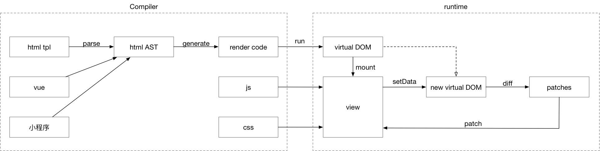

# cue

### 目标

渲染性能超越vue及regular。

[benchmarks](https://github.com/handoing/benchmarks)

### 流程图



### 运行

```bash
#初始化子模块
git submodule init
git submodule update

#拉取子模块
npm run pull:sub

#安装依赖
npm install

#启动本地服务
npm start
```

### 使用

tpl:

```html
<div
  class="main"
>
  
  <div class="toggle">toggle {{toggle}}</div>
  <span class="icon"></span>
</div>
```

js:

```js
module.exports = {
  data: {
    toggle: true,
    img: 'https://hao8.qhimg.com/t01c413c779df7eeecb.jpg'
  },
  created() {
    console.log('created');
  },
  updated() {
    console.log('updated');
  },
  mounted() {
    console.log('mounted');
  },
  destroyed() {
    console.log('destroyed');
  },
  onChange(e) {
    this.setData({
      toggle: !this.data.toggle
    })
  }
};
```

### 进度

compile:

- [x] 模板插值
- [x] 模板表达式
- [x] 模板事件
- [ ] 模板include
- [ ] 模板list
- [x] 模板if
- [ ] 过滤器
- [x] 指令
- [ ] 组件

runtime:

- [ ] 生命周期
  - [x] created
  - [x] updated
  - [x] mounted
  - [ ] destroyed
- [ ] 内建api
- [ ] 过滤器
- [ ] 指令
- [ ] 组件
- [ ] 插件机制
- [ ] 异步数据更新
- [x] 虚拟dom diff